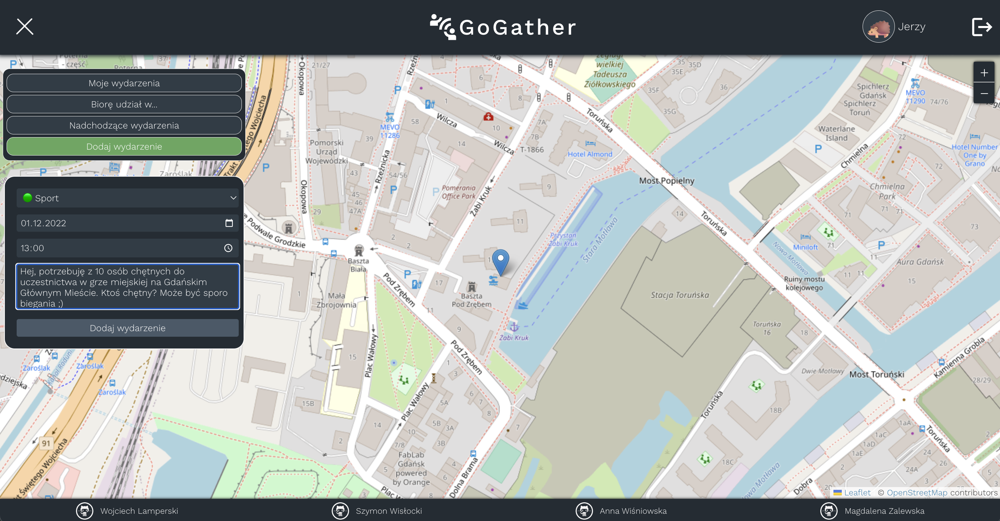
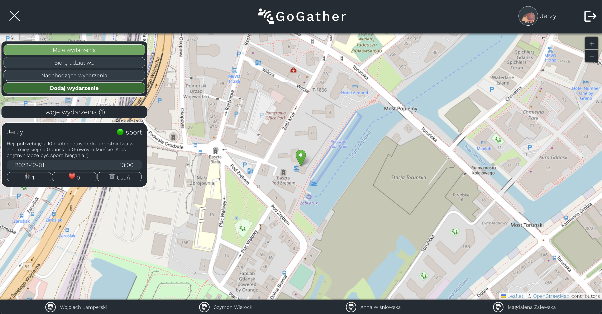
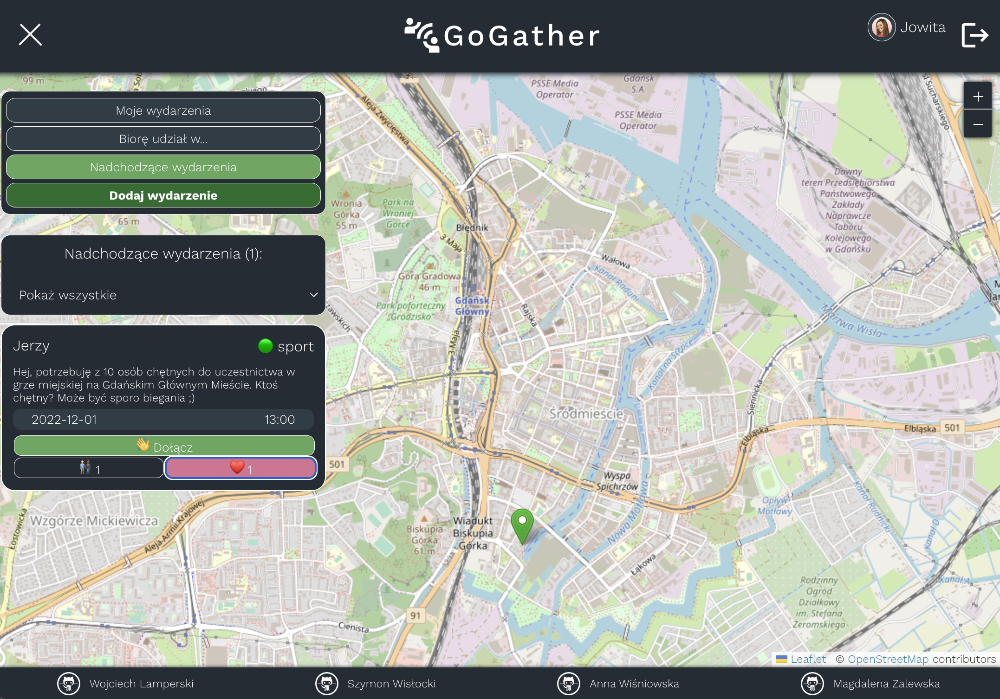
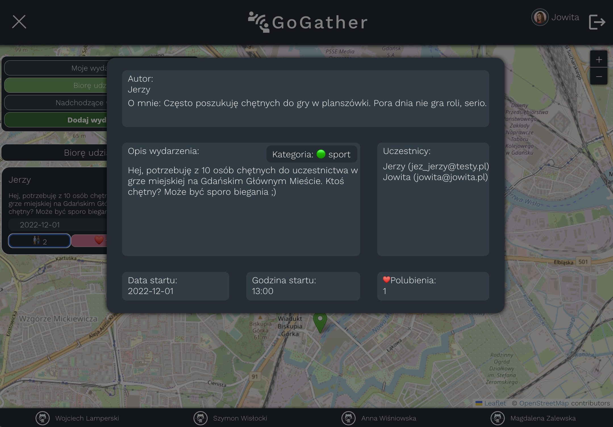
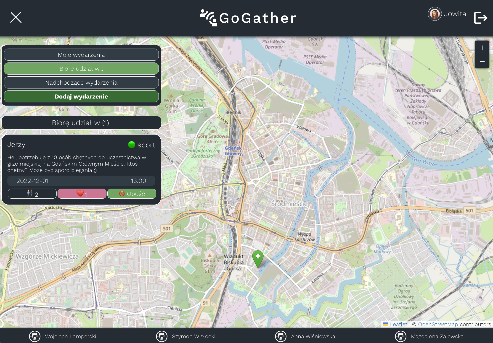

## GoGather

---

GoGather to projekt, który ma pomóc w organizacji szybkich, krótkich, spontanicznych wydarzeń na terenie Miasta Gdańska.
Duże serwisy społecznościowe udostępniają możliwość organizacji wydarzeń, jednak żeby je znaleźć, musimy z reguły przynależeć do jakiejś grupy, lub nawet do kilku grup, bo rzadko kiedy da się skupić wszystko w jednym miejscu.
Rozwijając – nawet gdy przystąpimy do grupy, dajmy na to, „wydarzenia trójmiasto”,
to nie mamy gwarancji, że wszyscy, którzy mieliby nam coś do zaoferowania, tam są.
Na dystansie, musielibyśmy uczestniczyć w nastu takich grupach i skazywać się na masę niepotrzebnych informacji i wydarzeń na main feedzie np. Facebooka.

W GoGather, mamy wszystko w aplikacji i podzielone na trzy kategorie.

GoGather nie zostało stworozne z myślą o wielkich eventach tworzonych przed duże organizacje kulturalne. To raczej lokalne zrzeszenie dla artystów, hobbystów, koneserów szztuki.

Z pomocą GoGather utworzysz łatwo spontaniczne wydarzenie – wypad do kina, na plażę, a może ćwiczenia speakingu z angielskiego? Służymy pomocą.

Zobacz, jak to działa na: [https://gogather-app.netlify.app](https://gogather-app.netlify.app)
lub rzuć okiem na poniższą prezentację...

---

Utwórz konto, dodaj krótki opis siebie oraz zdjęcie dla uwiarygodnienia profilu.

---

---

Gotowe! Teraz kliknij na mapę i dodaj wydarzenie - podaj krótki opis, wyznacz kategorię, ustal termin...

---

---

Prościzna. Od teraz widać Twoje wydarzenie na mapie oraz na pasku bocznym.

---

---

Właśnie polubiono twoje wydarzenie. Wydarzenia z największą ilością polubień są najbardziej widoczne na GoGather!

---

---

Kliknij na wydarzenie na mapie lub na liczbę uczestników na liście wydarzeń, by zobaczyć nieco więcej szczegółów - kilka słów o autorze oraz dane kontaktowe do innych uczestników.

---

---

Jednak nas nie zaszczycisz? W dowolnym momencie opuść wydarzenie, klikając przycisk Opuść na karcie wydarzenia.

Autorzy:
[Anna Wiśniowska](https://github.com/annavvis) •
[Magdalena Zalewska](https://github.com/magdalena-zalewska) •
[Szymon Wisłocki](https://github.com/szymonwislocki) •
[Wojciech Lamperski](https://github.com/WojciechLamperski)

Użyte technologie:

